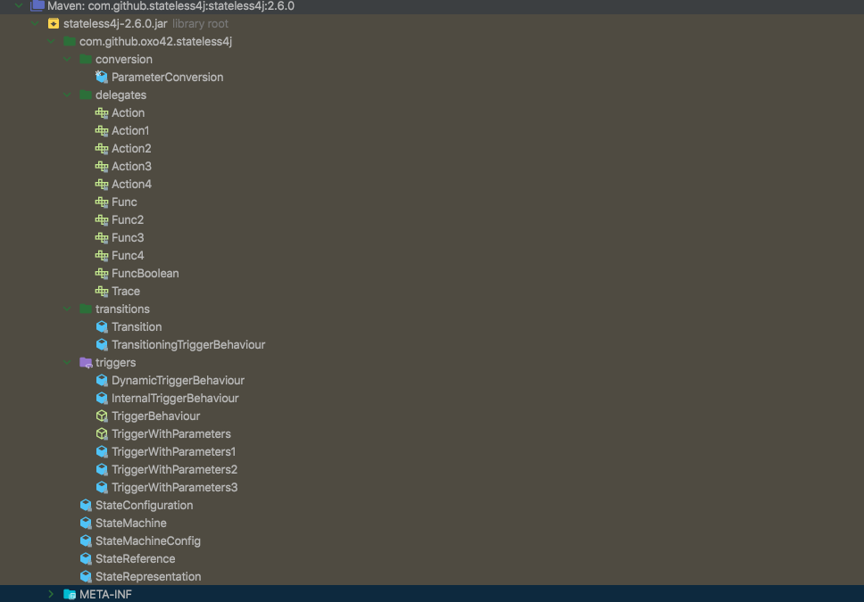

# statemachine-learn
状态机学习
# 前言

The concept of a state machine is most likely older than any reader of this reference documentation and definitely older than the Java language itself.
Description of finite automata dates back to 1943 when gentlemen Warren McCulloch and Walter Pitts wrote a paper about it. Later George H. Mealy presented a state machine concept (known as a “Mealy Machine”) in 1955.
A year later, in 1956, Edward F. Moore presented another paper, in which he described what is known as a “Moore Machine”. If you have ever read anything about state machines, the names, Mealy and Moore, should have popped up at some point.
----
状态机的概念很可能比本参考文档的任何读者都要老，而且肯定比Java语言本身还要老。对有限自动机的描述可以追溯到1943年，当时沃伦·麦卡洛克(Warren McCulloch)和沃尔特·皮茨(Walter Pitts)先生写了一篇关于它的论文。后来乔治·H·米利在1955年提出了状态机的概念(称为“米利机”)。一年后，也就是1956年，爱德华·F·摩尔发表了另一篇论文，在论文中他描述了被称为“摩尔机”的东西。如果你曾经读过关于状态机的任何东西，那么米利和摩尔这两个名字应该会在某个时候出现。

# 什么是状态机
概念
有限状态机(FSM)或有限状态自动机(FSA，复数：自动机)、有限自动机或简称状态机是计算的数学模型。它是一台抽象的机器，在任何给定的时间都可以处于有限数量的状态之一。
FSM可以根据某些输入从一种状态转换到另一种状态；从一种状态到另一种状态的变化称为转换。FSM由其状态、初始状态和触发每个转换的输入的列表定义。
1. 状态
2. 初始状态
3. 触发每个转换的输入的列表定义

e.g.  投币式旋转门
用于控制通往地铁和游乐园游乐设施的旋转门是一个大门，它有三个与腰部齐高的旋转臂，一个横跨入口。最初，手臂是锁着的，挡住了入口，防止顾客通过。将一枚硬币或代币放在旋转栅门上的狭缝中，就可以解锁手臂，允许一个顾客推过去。在顾客通过后，手臂再次锁定，直到另一枚硬币被插入。
对应状态图如下

状态:  锁定 解锁
初始状态 : 锁定

动作: 投币 推动
行为: 锁定 解锁

触发每个转换的输入的列表定义:  锁定投币  锁定推动 解锁投币 解锁推动

# 相应的框架
## spring-statemachine
描述
特点

优势
劣势

## easy states  (starts 187)
### 描述

简单并且易上手的状态机模型

简单的状态机模型API提供了状态机的核心概念

- 状态：机器可以处于给定时间点的一种特定状态
- 事件：表示可能触发操作并更改计算机状态的事件
- 过度: 表示发生事件时计算机的两个状态之间的转换
- 有限状态机: 有限状态机的核心抽象

### 特点

- 简单易上手

### 优势
- 上手简单
- 代码容易

### 劣势

- 只是状态机的基本概念对于复杂的场景支持力度不够

## stateless4j (starts 721)
### 描述
轻量级状态机

### 特点
Entry/exit events for states

### 结构

### demo
存在的问题
1. 在非法的请求中会抛出异常

## JSate (starts 91)

### description
A core Java tool which provides state machine semantics using enums, strings, or anything else you want to represent the various states.

### feature

## squirrel (starts 1.9k)
squirrel-foundation is a State Machine library, which provided a lightweight, easy use, type safe and programmable state machine implementation for Java.
### feature

## spring-statemachine

### 相关demo
spring-statemachine
squirrel
stateless4j
easy-states
JState

参考文档
- Java状态机调研报告: https://juejin.cn/post/6844904170852450318
- uml2.4 状态机图解: https://www.uml-diagrams.org/state-machine-diagrams.html
- 有限状态机 wiki百科:  https://en.wikipedia.org/wiki/Finite-state_machine
- easy-states 地址: https://github.com/j-easy/easy-states
- stateless4j 地址: https://github.com/stateless4j/stateless4j
- jSate 地址: https://github.com/UnquietCode/JState
- squirrel 地址: http://hekailiang.github.io/squirrel
- spring-statemachine 地址: https://spring.io/projects/spring-statemachine

